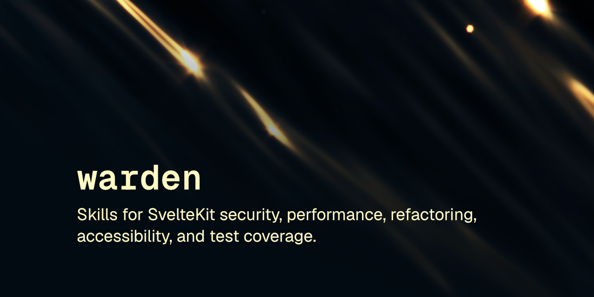

<p align="center"></p>

# tend

7 skills scan repo, fix 1 issue, verify, stop. No commit, no CI minutes.

[](LICENSE) [](https://skills.sh/robcsaszar/tend)

Local, on-demand maintenance skills for SvelteKit + TypeScript repos. Each skill finds the single highest-priority issue in its domain, fixes it, verifies the fix, and leaves the diff in your working tree for review. No branches, no PRs, no CI minutes spent.

These skills follow the [Agent Skills specification](https://agentskills.io/specification) so they can be used by any skills-compatible agent.

## Installation

### npx skills

```
npx skills add robcsaszar/tend
```

### Marketplace

```
/plugin marketplace add robcsaszar/tend
/plugin install robcsaszar-tend@tend
```

### Manually

Copy the `skills/` directory into your project's `.claude/skills/`, or a specific skill folder for a single one. See "Installing a single skill" below.

## First run: `tend-onboard`

Run `tend-onboard` once per repo before the others. It detects your stack (SvelteKit version, which of the 5 capability modules apply, existing off-limits conventions) and writes `.claude/tend/config.yaml`, which every other skill reads at Phase 0. Skipping this step isn't an error. Every skill runs at a conservative **core tier** with no config present, but module-specific checks (auth, realtime, data, validation, feature-flags) only activate once onboarding has run.

Re-run `tend-onboard` after a significant dependency or stack change; module activation is detected once at onboard time, not on every scan.

## Usage

Every skill in this pack is invoked explicitly, never automatically. Run `/tend-onboard`, `/tend-security`, `/tend-perf`, and so on by name. This is deliberate: a full pass is running each skill in turn yourself, not an unattended sweep. See `AGENTS.md` for why.

## Skills

| Skill | Description |
|-------|-------------|
| [tend-onboard](skills/tend-onboard) | Detects your stack and writes `.claude/tend/config.yaml`: run this first |
| [tend-security](skills/tend-security) | Finds and fixes one exploitable security issue per run: XSS, secrets, authn/authz, CSP, plus opt-in module packs (auth, validation, realtime, data, feature-flags) |
| [tend-perf](skills/tend-perf) | Finds one performance fix per run that's mechanically provable from code inspection alone: no profiling, no guessing |
| [tend-refactor](skills/tend-refactor) | Dead code and duplication removal, type-safety tightening, and component/markup extraction: one atomic change per run |
| [tend-a11y](skills/tend-a11y) | Accessibility and copy-tone checks: semantic markup, ARIA, async-loading and destructive-action states, tone consistency |
| [tend-tests](skills/tend-tests) | Finds untested functions matching your repo's existing dependency-injection/mocking convention and writes the missing test |
| [tend-docs](skills/tend-docs) | Bidirectional doc-vs-code drift audit. Dogfood-only: shipped in the pack, tuned for this project's own use rather than broad genericness |

## Installing a single skill

```
npx skills add robcsaszar/tend --skill tend-security
```

Or manually, copy just that skill's directory:

```sh
cp -r skills/tend-security /path/to/project/.claude/skills/
```

## Design

Every skill shares one shape: load config → triage → scan (stop at the first real hit) → fix (one atomic, verified change) → present the diff and stop. None of these skills commit or open a PR. You review and commit yourself. See each skill's `SKILL.md` for its full phase breakdown, and `tend-onboard/references/config-schema.md` for the config file this pack shares.

**Known unverified item:** whether `npx skills add` copies a skill's full folder (`references/`, `scripts/`) or only `SKILL.md`. If you install a skill and its reference files or validator script are missing, install manually instead (see above) until this is confirmed.

## Safety

`tend-onboard`, `tend-security`, `tend-tests`, and `tend-refactor` ship small validator scripts. Read [SAFETY.md](SAFETY.md) for what each one does.

## License

[MIT](LICENSE) © Rob Csaszar
